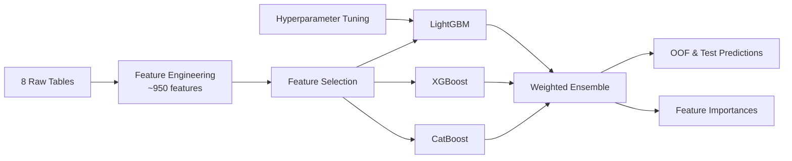

# Loan Default Prediction

[](https://github.com/oliver-house/credit-risk-modelling/actions/workflows/ci.yml)

End-to-end credit risk modelling pipeline engineering ~950 features from 8 relational datasets into a tuned LightGBM + XGBoost + CatBoost ensemble. Challenging due to significant class imbalance (~8% default rate) and sparse signal across multiple relational tables.

## Pipeline



## Results

3-fold stratified cross-validation on `application_train.csv` (307,511 rows, 8.07% positive).

<!-- results:start -->

| Model | OOF AUC | Weight |
|-------|---------|--------|
| LightGBM | 0.78791 | 0.14 |
| XGBoost | 0.79102 | 0.42 |
| CatBoost | 0.79087 | 0.44 |
| **Ensemble** | **0.79348** | — |

<!-- results:end -->

Blend weights are grid-searched on the same out-of-fold predictions the ensemble AUC is then measured on, so **0.79348 is a mildly optimistic estimate** of held-out performance — the three single-model AUCs above it are not. Quantifying that gap needs a split held back from cross-validation entirely; see Future Work.

The table above and both plots below come from a single run of `train.py`. That run predates the tuned-parameter wiring, so all three models used the `src/config.py` defaults — which is why LightGBM is the weakest here despite being the model `tune.py` targets. Re-running `train.py` now picks up the Optuna params in `params/lgbm_best_params.json`, so these figures will move; the plots are overwritten automatically and the table is regenerated by `update_readme.py`.


All four panels rank the *same* features by ensemble importance and show what each model scored them — a like-for-like comparison, not four separate top-30 lists.

## Key Findings

- External data source scores (`EXT_SOURCE_1/2/3`) and their engineered interactions dominate predictive signal, accounting for 14.3% of cumulative ensemble importance
- XGBoost and CatBoost contribute near-equally (0.42/0.44); LightGBM adds marginal value (0.14) at default hyperparameters
- The strongest non-EXT_SOURCE predictors are `PAYMENT_RATE`, `PREV_INTEREST_RATE_max`, and `DAYS_EMPLOYED`
- 8.9% of initially engineered features had zero importance across all three models; the majority are NaN indicators and rare one-hot encoded categories

## Repository Structure

```
train.py                    # Entry point: feature engineering, training, weight tuning, predictions
tune.py                     # LightGBM hyperparameter tuning with Optuna
src/
  config.py                 # Paths, constants, model parameters
  features/
    pipeline.py             # Orchestrates feature engineering
    application.py          # Main application table features
    bureau.py               # Credit bureau features
    previous_application.py # Previous Home Credit application features
    pos_cash.py             # POS cash balance features
    installments.py         # Instalment payment features
    credit_card.py          # Credit card balance features
  models/
    lgbm_model.py           # LightGBM training
    xgb_model.py            # XGBoost training
    catboost_model.py       # CatBoost training
  utils/
    helpers.py              # Logging, memory reduction, timing
tests/                      # Unit tests - synthetic data, no Kaggle download needed
params/
  lgbm_best_params.json     # Best LightGBM hyperparameters from tune.py (loaded automatically by train.py)
  selected_features.json    # Features selected by cumulative importance threshold (loaded automatically by train.py)
reports/                    # Committed plots (ROC curve, feature importances)
predictions/                # Generated OOF/test predictions and metrics (gitignored — large)
```

## Design Decisions

- **Ensemble over single model** — blending LightGBM, XGBoost and CatBoost outperforms any individual model in all runs
- **Stratified K-Fold** — preserves the ~8% default rate in each fold, ensuring each fold is representative of the full dataset
- **Cumulative importance feature selection** — retains features accounting for 99% of ensemble feature importance, automatically dropping zero- and near-zero-importance features on subsequent runs
- **Separate tuning script** — `tune.py` tunes LightGBM hyperparameters on a row sample via Optuna TPE search; best params are saved to `params/` and loaded automatically by `train.py`
- **Structural params live in `config.py`, tuned params in `params/`** — `LGBM_PARAMS` holds the non-negotiable keys (`objective`, `metric`, `n_estimators`) and Optuna's results are layered on top. Keeping the two apart means a tuning run cannot accidentally strip the objective, and `train.py` still runs on a clean clone before any tuning has happened

## Data

Download the data from [here](https://www.kaggle.com/competitions/home-credit-default-risk/data) and place the following files in `data/` in the project root:

```
data/
  application_train.csv
  application_test.csv
  bureau.csv
  bureau_balance.csv
  POS_CASH_balance.csv
  credit_card_balance.csv
  previous_application.csv
  installments_payments.csv
```

## Requirements

Python 3.11 or newer. Dependencies listed in `requirements.txt`; the pipeline targets pandas 3.x. CI runs the suite on 3.11, 3.12, 3.13 and 3.14.

## Setup

```powershell
python -m venv venv
.\venv\Scripts\Activate.ps1
pip install -r requirements.txt
```

## Run

```powershell
python train.py
```

Sanity-check the pipeline first on 5,000 rows and 2 folds. This writes to `predictions/smoke/` and `reports/smoke/` and leaves the committed artefacts untouched:

```powershell
python train.py --smoke
```

Optionally tune LightGBM hyperparameters before training:

```powershell
python tune.py --trials 50 --folds 3
```

Tuned params are already committed to `params/lgbm_best_params.json` and loaded automatically by `train.py`. Run `tune.py` again with a narrower search space to refine further.

## Tests

```powershell
pip install -r requirements-dev.txt
pytest
```

Covers feature engineering, the shared utilities, ensemble weight tuning, and the parameter loader. Everything runs on synthetic frames in a few seconds, so the Kaggle download is not needed to check out the repo and verify it works.

## Future Work

- Evaluate on a split held back from cross-validation entirely, to measure how much the OOF-tuned blend weights inflate the ensemble AUC
- Hyperparameter tuning for XGBoost and CatBoost (currently only LightGBM is tuned)
- Feature interactions between EXT_SOURCE scores and credit/income ratios
