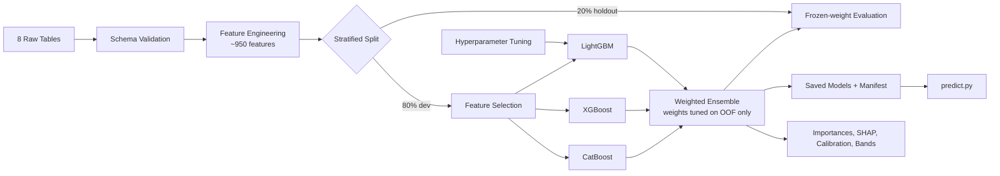
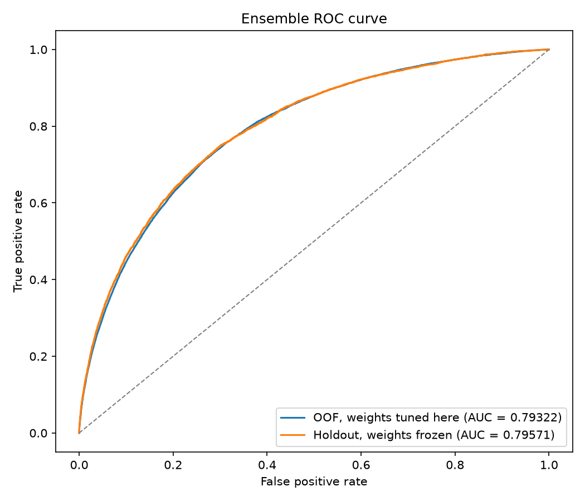
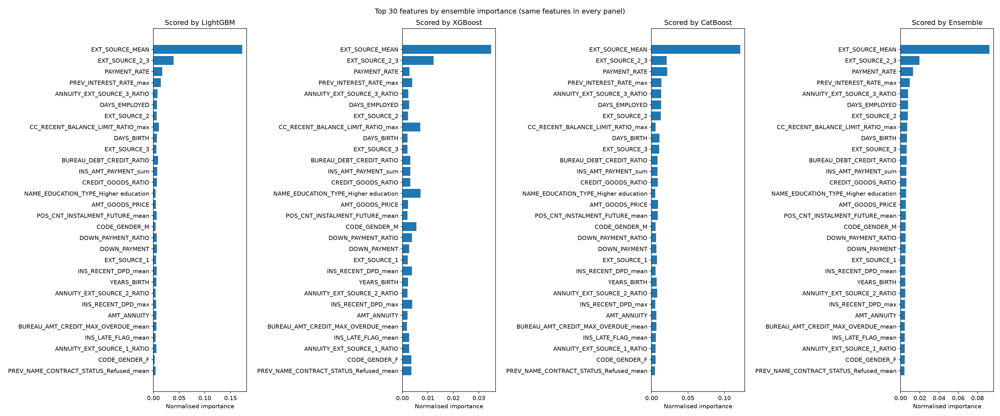
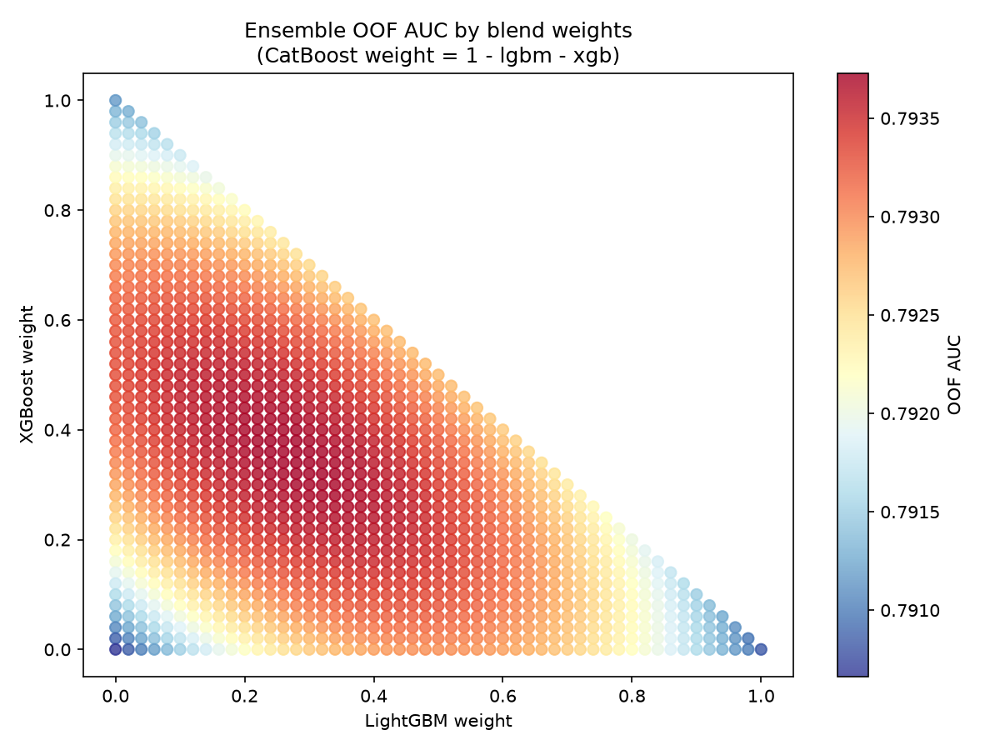

# Loan Default Prediction

[](https://github.com/oliver-house/credit-risk-modelling/actions/workflows/ci.yml)

End-to-end credit risk modelling pipeline engineering ~950 features from 8 relational datasets into a tuned LightGBM + XGBoost + CatBoost ensemble, with a held-out slice to measure the optimism in its own headline number, saved models, an inference path, input validation, run tracking and a business-facing evaluation layer. Challenging due to significant class imbalance (~8% default rate) and sparse signal across multiple relational tables.

## Pipeline



## Results

<!-- results:start -->

| Model | OOF AUC | Weight |
|-------|---------|--------|
| LightGBM | 0.79084 | 0.28 |
| XGBoost | 0.79117 | 0.34 |
| CatBoost | 0.79066 | 0.38 |
| **Ensemble** | **0.79373** | — |

<sub>3-fold CV · 307,511 rows · 657 features · no holdout</sub>

<!-- results:end -->

> **These numbers predate the holdout split and the move to 5 folds.** They are the
> last full run and are kept because they are real, not because they are current.
> The pipeline now takes a 20% stratified slice off before any cross-validation and
> runs 5 folds, so every figure above will move when the run below is executed.
> Delete this note once it is.
>
> ```powershell
> python train.py --update-features --save-features
> python explain.py; python evaluate.py; python update_readme.py
> ```

`update_readme.py` rewrites the table and the provenance line under it from
`predictions/results.json`, so the fold count, holdout size, row count, feature count
and a sha256 of the exact feature set are always the ones that produced the numbers
shown. The three plots below come from the same run as the table above and are
overwritten by the training run itself.

### On the ensemble number

`_tune_weights` grid-searches 1,326 blend-weight combinations and scores each with
`roc_auc_score` on the same out-of-fold predictions, then reports the best. The
ensemble figure is therefore the maximum of 1,326 draws measured against the data
they were drawn on, and optimistic by construction; the three single-model AUCs
beside it are not.

Earlier versions of this README bounded that optimism by argument — the weight
surface is a broad plateau, 16% of the grid lands within 0.0002 of the best score,
so there is little room to overfit. That argument is still true and the plot below
still shows it, but it is now supporting colour rather than the bound. A stratified
20% slice is held back before any cross-validation, the weights are tuned on the
remaining 80%, and those weights are applied to the held-out slice exactly once.
`results.json` reports two figures from that:

- **`oof_minus_holdout`** — the headline OOF number less the same blend measured
  blind. It absorbs ordinary train/holdout sampling noise as well as the weight
  search's optimism, so it bounds the latter rather than measuring it.
- **`ensemble_gain_holdout`** — the ensemble less the best single model, both on the
  same unseen rows. This is the one that isolates what the blend actually buys.





All four panels rank the *same* features by ensemble importance and show what each model scored them — a like-for-like comparison, not four separate top-30 lists.



Every corner of that triangle is a single model at weight 1.0, and all three are dark — any reasonable blend beats any individual model. The optimum is also a broad plateau rather than a peak: 16% of the 1,326 grid points land within 0.0002 of the best score, and the entire surface spans just 0.00307.

## Key Findings

- External data source scores dominate predictive signal: the 16 `EXT_SOURCE`-derived features account for 20.8% of ensemble importance, and the engineered `EXT_SOURCE_MEAN` alone accounts for 13.4% — more than the next eleven features combined
- The strongest non-`EXT_SOURCE` predictors are `PAYMENT_RATE`, `PREV_INTEREST_RATE_max`, and `CC_RECENT_BALANCE_LIMIT_RATIO_max` — all three engineered, and all ahead of the best raw column outside `EXT_SOURCE` (`DAYS_EMPLOYED`)
- Tuning LightGBM moved it from 0.78791 to 0.79084, closing the gap to the other two models. Blend weights shifted from 0.14/0.42/0.44 to a near-even 0.28/0.34/0.38 as a result
- Cumulative-importance feature selection is close to free: XGBoost, whose hyperparameters did not change between runs, scored 0.79117 on the retained 657 features against 0.79102 on the original 951 — unchanged within noise after dropping 31% of them
- The ensemble still beats the best single model by +0.0026 even though the three now score within 0.0006 of each other, so their errors stay decorrelated despite near-identical accuracy
- 3,120,184 rows of `bureau_balance.csv` (11.4%) reference a `SK_ID_BUREAU` that does not appear in `bureau.csv`, so that monthly history is silently dropped by the join. Surfaced by the schema check, not by anything in the feature code

### A caveat on the 20.8%

That figure is a blend of the models' built-in importances, and those are **not the
same statistic across the three**. `lgbm_model.py` asks for gain, `xgb_model.py` sets
`importance_type="gain"` on the constructor, but `catboost_model.py` was calling
`get_feature_importance()` with no argument, whose default for a Logloss model is
`PredictionValuesChange` rather than gain. It now names the type explicitly so the
difference is visible rather than implied by a default.

Both families of importance are also known to favour high-cardinality continuous
features, which is exactly what the `EXT_SOURCE` columns are — so the headline needed
an independent check. `explain.py` computes exact TreeSHAP over a row sample and
reports the rank correlation between the two rankings, the overlap of their top-20
lists, and each method's `EXT_SOURCE` share. Run it after the next full run and
record what it says here, whichever way it lands.

## Repository Structure

```
train.py                    # Entry point: validate, build features, hold out, train, tune weights
predict.py                  # Score a batch of new applicants from a saved run
explain.py                  # TreeSHAP importances, compared against the built-in ones
evaluate.py                 # Calibration, score bands, cost-sensitive threshold, logistic baseline
tune.py                     # LightGBM hyperparameter tuning with Optuna
update_readme.py            # Rewrites the results table above from predictions/results.json
Dockerfile                  # python:3.14.7-slim, installs requirements.lock
tools/lock.py               # Regenerates requirements.lock from requirements.txt
src/
  config.py                 # Paths, constants, model parameters, cost assumptions
  tracking.py               # MLflow run tracking, degrading to a no-op if unavailable
  evaluation.py             # Gini, KS, bands, calibration, threshold, logistic baseline
  explanations.py           # Native TreeSHAP extraction and the ranking comparison
  validation/
    schemas.py              # Declared schema for all eight source tables
    check.py                # `python -m src.validation.check` to validate data/ standalone
  features/
    pipeline.py             # Orchestrates feature engineering; training and scoring paths
    application.py          # Main application table features
    bureau.py               # Credit bureau features
    previous_application.py # Previous Home Credit application features
    pos_cash.py             # POS cash balance features
    installments.py         # Instalment payment features
    credit_card.py          # Credit card balance features
  models/
    base.py                 # FoldResult, native model serialisation, run manifest
    lgbm_model.py           # LightGBM training
    xgb_model.py            # XGBoost training
    catboost_model.py       # CatBoost training
  utils/
    helpers.py              # Logging, memory reduction, timing
tests/                      # Unit tests - synthetic data, no Kaggle download needed
params/
  lgbm_best_params.json     # Best LightGBM hyperparameters from tune.py (loaded automatically)
  selected_features.json    # Pinned feature set (an *input*; promoted with --update-features)
reports/                    # Committed plots (ROC curve, feature importances, weight tuning)
models/                     # Saved fold models and manifest.json (gitignored - large)
mlruns/                     # MLflow run history (gitignored)
predictions/                # Generated predictions, metrics and feature caches (gitignored)
```

## Reproducibility

`params/selected_features.json` used to be both an input to `train.py` and an output
of it, so the committed file always described the *next* run rather than the one whose
numbers were reported. That is how it came to hold 611 features while this README
described the run that consumed 657, and it made the claim that the results were
reproducible from the commit false as written.

A run now writes its new selection to `predictions/selected_features.json` and leaves
`params/` alone. Promotion is explicit:

```powershell
python train.py --update-features
```

`results.json` also records the fold count, holdout size, row count, feature count,
the source path of the feature set consumed and a sha256 of it, and
`update_readme.py` renders those under the table — so a stale table is visible as
stale rather than a matter of trust.

## Input Validation

Every aggregation spec in the feature modules is filtered by `if k in df.columns`, so
a renamed or retyped column drops out of the feature set without a word, and the
pipeline's object-column sweep coerces a stray string to `NaN`. Both produce a model
that trains happily and scores wrongly.

`src/validation/schemas.py` declares all eight tables — columns present, dtypes,
nullability, key uniqueness, plausible ranges and closed category sets — and reports
every violation at once rather than failing on the first. Two severities, because
real credit data is untidy:

- **error** — structure the pipeline depends on. A missing column, a non-numeric
  numeric column, a null or duplicated key, or a value outside a range that feature
  code branches on or divides by: an `EXT_SOURCE` outside `[0, 1]`, a positive
  `DAYS_BIRTH`, a `CREDIT_ACTIVE` string the ACTIVE/CLOSED split does not recognise.
- **warn** — values outside what the training data held. One applicant reports 117m
  of income and that must not stop a run.

Checked against all eight files in full: zero errors, and two warnings worth knowing
about — `application_test.csv` carries one `REGION_RATING_CLIENT_W_CITY` of `-1`, and
the orphaned `bureau_balance` rows noted above.

```powershell
python -m src.validation.check
python -m src.validation.check --tables bureau installments --rows 100000
```

`--no-validate` on `train.py`, `tune.py` and `predict.py` skips it.

## Inference

Training saves each fold model in its own library's format — `.txt`, `.ubj`, `.cbm`,
not pickles, which are tied to the exact build that made them — alongside
`models/manifest.json` recording the ordered feature list, the hyperparameters, the
fold count, the blend weights, library versions and the git commit.

```powershell
python predict.py --input applicants.csv --aux-dir data/ --output scores.csv
```

`--input` is an application CSV shaped like `application_test.csv`; `--aux-dir` holds
the other seven tables. A missing auxiliary table leaves its aggregates blank with a
warning rather than failing — a batch with no bureau extract is an operational case,
not an error.

Two details make the served score the same score the model was evaluated on:

- **Column fill is not uniform.** Application-block columns are filled with 0,
  reproducing the `fillna(0)` the training pipeline applies to the aligned test frame.
  Aggregate columns are left as `NaN`, which is what a left merge gives an applicant
  with no history, and what the boosters were trained to route. The manifest records
  which columns are which, because inference cannot work it out for itself.
- **The training pipeline is asymmetric here, and this reproduces it rather than
  fixing it.** `test.fillna(0)` replaces *every* remaining null in the test
  application block, missing `EXT_SOURCE` scores included, while the train block keeps
  its nulls. Scoring matches the test-side treatment deliberately, so a served score
  matches the pipeline that produced `test_predictions.csv`. Changing it would move
  every number in the repository, so it is flagged here rather than quietly altered.

One caveat: with a small batch, a one-hot category no applicant happens to carry
produces no column at all, so an aggregate that would have been 0 in training arrives
as missing. The count and a sample are logged; patching it would be guesswork.

## Experiment Tracking

Each run is recorded to a local MLflow store under `mlruns/` — parameters, every AUC,
both optimism figures, the blend weights and the run's artefacts. Previously each run
overwrote `predictions/results.json` and left no history.

Two choices worth stating, both forced by the environment:

- **`mlflow-skinny`, not `mlflow`.** The full package pins `pandas<3` and this
  pipeline targets pandas 3.x. Skinny carries the tracking client and the stores but
  not the bundled UI — browse the runs from a separate environment pointed at
  `mlruns/mlflow.db`.
- **SQLite, not the plain directory store.** MLflow 3.x raises outright on a `file:`
  tracking URI unless `MLFLOW_ALLOW_FILE_STORE=true` is set, having put that backend
  into maintenance mode. SQLite is still local and serverless, and `sqlalchemy` and
  `alembic` already arrive with Optuna.

Tracking never breaks a run: a missing package or any MLflow error degrades to a
warning. `--no-tracking` opts out.

## Business Evaluation

AUC says the model ranks applicants correctly and nothing else. `evaluate.py` reports
what a credit team would actually ask for, measured on the held-out slice:

```powershell
python evaluate.py
```

- **Gini and KS**, plus a decile band table with bad rate, lift and cumulative bad
  capture, written to `reports/score_bands.md`
- **Calibration** in equal-count bins with the Brier score and a fitted slope, plus an
  isotonic recalibration fitted on the OOF predictions and applied to the holdout,
  shown beside the raw curve rather than instead of it
- **A cost-sensitive threshold**, swept over every observed score so the optimum is
  exact. `COST_FN` and `COST_FP` in `config.py` default to **10:1** — roughly
  loss-given-default on principal against forgone margin on one loan. That ratio is a
  business judgement, not a property of the model, so the chosen cut-off is also
  reported across 2:1 through 50:1
- **A logistic regression baseline** — median impute, standardise, L2 logit —
  cross-fitted on the same folds and scored on the same holdout. If the ensemble
  cannot beat a scorecard by a margin worth its operational cost, that is the finding

## Design Decisions

- **Ensemble over single model** — blending LightGBM, XGBoost and CatBoost outperforms any individual model in all runs
- **Stratified K-Fold** — preserves the ~8% default rate in each fold, ensuring each fold is representative of the full dataset
- **Holdout before cross-validation** — the blend weights are tuned on out-of-fold predictions, so measuring the ensemble on those same predictions is circular. A 20% slice split off before anything else touches the data is what makes the reported gap a measurement
- **Cumulative importance feature selection** — retains features accounting for 99% of ensemble feature importance, automatically dropping zero- and near-zero-importance features on subsequent runs
- **Feature selection is a pinned input, not a side effect** — see Reproducibility above
- **Separate tuning script** — `tune.py` tunes LightGBM hyperparameters on a row sample via Optuna TPE search; best params are saved to `params/` and loaded automatically by `train.py`
- **Structural params live in `config.py`, tuned params in `params/`** — `LGBM_PARAMS` holds the non-negotiable keys (`objective`, `metric`, `n_estimators`) and Optuna's results are layered on top. Keeping the two apart means a tuning run cannot accidentally strip the objective, and `train.py` still runs on a clean clone before any tuning has happened
- **Native model serialisation over pickle** — a pickled booster is tied to the exact library build that created it; all three libraries ship a documented format of their own
- **No `shap` dependency** — all three libraries compute exact TreeSHAP natively, so the comparison needs no new package, no numba, and no floor on the CI Python matrix

## Data

Download the data from [here](https://www.kaggle.com/competitions/home-credit-default-risk/data) and place the following files in `data/` in the project root:

```
data/
  application_train.csv
  application_test.csv
  bureau.csv
  bureau_balance.csv
  POS_CASH_balance.csv
  credit_card_balance.csv
  previous_application.csv
  installments_payments.csv
```

`CREDITRISK_DATA_DIR` overrides the location.

## Requirements

Python 3.11 or newer. Dependencies listed in `requirements.txt`; the pipeline targets pandas 3.x. CI runs the suite on 3.11, 3.12, 3.13 and 3.14. `requirements.lock` holds exact pins for the container image and is regenerated with `python tools/lock.py`.

## Setup

```powershell
python -m venv venv
.\venv\Scripts\Activate.ps1
pip install -r requirements.txt
```

## Run

```powershell
python train.py
```

Sanity-check the pipeline first on 5,000 rows and 2 folds. This writes to `predictions/smoke/`, `reports/smoke/` and `models/smoke/` and leaves the committed artefacts untouched:

```powershell
python train.py --smoke
```

Useful flags: `--update-features` promotes this run's feature selection to `params/`;
`--save-features` caches the built matrices so `explain.py` and `evaluate.py` need not
rebuild them; `--holdout-frac 0` trains on everything once the estimate is in hand;
`--no-tracking` and `--no-validate` opt out of MLflow and the schema check.

Optionally tune LightGBM hyperparameters before training:

```powershell
python tune.py --trials 50 --folds 3
```

Tuned params are already committed to `params/lgbm_best_params.json` and loaded automatically by `train.py`. Run `tune.py` again with a narrower search space to refine further.

## Docker

The image pins every dependency and mounts the data rather than baking in the ~2.6 GB
of CSVs. `libgomp1` is installed explicitly — LightGBM and XGBoost link against
OpenMP at runtime and `python:slim` ships none, so without it both import cleanly and
then fail on the first fit.

```powershell
docker build -t creditrisk .
docker run --rm -v "${PWD}/data:/app/data" -v "${PWD}/models:/app/models" `
  -v "${PWD}/predictions:/app/predictions" creditrisk train.py
docker run --rm -v "${PWD}/data:/app/data" -v "${PWD}/models:/app/models" `
  -v "${PWD}/out:/app/out" creditrisk `
  predict.py --input /app/data/application_test.csv --output /app/out/scores.csv
```

## Tests

```powershell
pip install -r requirements-dev.txt
pytest
```

Covers all six feature modules, the schema declarations, model persistence and
reload, the holdout split, weight tuning, the SHAP extraction, the evaluation
functions, MLflow tracking, the parameter loader and the README updater — plus an
end-to-end check that the inference path reproduces the training path cell for cell
on a synthetic eight-table dataset. Everything runs on synthetic frames in under a
minute, so the Kaggle download is not needed to check out the repo and verify it
works.

## Future Work

- Hyperparameter tuning for XGBoost and CatBoost (currently only LightGBM is tuned)
- Feature interactions between EXT_SOURCE scores and credit/income ratios
- Resolve the train/test null-handling asymmetry noted under Inference, which needs a full re-run to re-baseline every number
- Population stability monitoring against the score bands, once there is a second batch to compare
